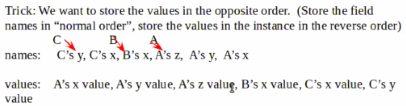

# EECS 345 Final Cheat-Sheet

## Table of Contents
[Notes from Prof. Connamacher](#Notes-from-Connamacher)  
[Denotational Semantics](#Denotational-Semantics)  
[Scope and Reference Variable Passing](#Scope-and-Reference-Variable-Passing)  
[Function Closures](#Function-Closure)  
[Memory Management](#Memory-Management)  
[Types and Type Systems](#Types-and-Type-Systems)  
[Object Oriented Programming](#Object-Oriented-Programming)  
[Scheme](#Scheme)  
[Haskell](#Haskell)  
[Prolog](#Prolog)  
[Homework Solutions](#Homework-Solutions)  

---

## Notes from Connamacher
- all at the same time
- typed into canvas
- write programs
    - scheme
    - haskell (won't be picky, but more so than Prolog)
        - will involve types
    - prolog (won't be picky, wont compile himself)
    - open book, open note -> can write the program and run, but shouldn't spend a lot of time if you choose to do so
    - he is mainly looking for thought process when we code (don't try and implements a Java construct in Haskell, etc)
- Closures
- Denotational Semantics
- everything that's shown up on a homework problem
- NO axiomatic semantics
- NO static semantics
- NO basic definitions

---

## Denotational Semantics

- mapping a syntax construct to a mathematical object
- **<code>M<sub>value</sub></code>**
    - m stands for "mapping"
    - maps the value of a symbol
    - ex: <code>M<sub>value</sub>('123') = Mv('1') * 100 + Mv('2') * 10 + Mv('3')</code>
    - used to convert from BNF rules to actual values
- **state**
    - a mathematical object which is a mapping between names a values
    - ex: <code>((x,5)(y,10),(z,0))</code>
        - can us a **LOOKUP** function to retrieve variable values
    - this should be conjoined with  Mv functions to conjoin BNF rules and variable values
    - therefore: <code>Mv(*variable*, state) = Mv(Lookup(*variable*, state))</code>
- Side Effects
    - can happen if a state changes in a conditional
    - ex: <code>if(i = 3 > 2)</code> would have an affect on the state of the program
    - to account for this make sure you replace <code>state</code> with <code>Ms(\<conditional\>, Ms(state))</code> where it is needed. Just be sure to think through these problems thoroughly.

---

## Scope and Reference Variable Passing
- scope
    - static scope
        - scoping as known in Java, aka *scope of declaration*
    - dynamic scope
        - uses the most recent variable in the call stack
- reference variable passing
    - call-by-value
        - parameter values are copied from the variables used in the method call to new variables generated by the function closure
    - call-by-reference
        - the pointer of the variable is passed as the parameter, meaning the function edits the parameter directly
    - call-by-value-result
        - parameter values are copied (similar to call-by-value) however at the end of the function body the values are copied back from the formal parameters to their corresponding variables
    - call-by-name
        - the parameter is evaluated when it is accessed, rather than when the function is run

---

## Function Closure
- consists of
    - formal parameters
    - function body
    - function that creates the state/environment that is active for the function call
- when a function definition is found, need to create a closure for the function and store the closure in the state, bound to the function name
- when a function is called:
    1. create the state for the function call via calling the function in the closure
    2. add a layer, eval each of the actual params (in the current state) and bind them to the formal params. place in the function state
    3. execute the function body, setting a new return continuation

---

## Memory Management
- memory errors
    - **memory leak**
        - when you allocate memory but loose the reference such that you can no longer reallocate it.
    - **dangling pointer**
        - when you deallocate memory but you still have a reference to the memory, where the reference throws an error when that reference is then deallocated again
    - **segmentation violation**
        - when you try to access memory that your process is not permitted to access
    - **stack smash**
        - when a buffer (allocated on a stack) is overflown where it overrides the allocated memory adjacent to it.
- solutions to a **memory leak**
    - reference counters - active
        - language must keep track of all the pointers in the program
        - for each piece of allocated memory, have a counter of how many pointers are pointing at it (how many pointers are storing the address)
        - when this number is 0, deallocate the memory
    - mark and sweep - passive (garbage collection)
        - every now and then, the program will pause and mark all allocated pieces of memory as "not needed".
        - then start at the stack, DPS for references starting from the top. Mark found reference as "still used"
        - once the DFS is done, deallocate any memory still marked as "not needed"
        - problem w/ garbage collection is that you must stop the program
            - how oracle handles this w/ java (industry standard)
                - divides the heap into sections:
                    - eden
                    - S0/S1
                    - tenured memory
                    - permanent memory
                - all new allocations are from eden
                - permanent memory is used f/ things like class objects
                - when eden fills up, the program stalls to do a garbage collection
                    - as such only the memory in eden & S0/S1 is explored
                - note that one of the S0/S1 is used, the other is empty
                - everything that survives the garbage collection is placed in the empty S0/S1, then eden and the other S0/S1 is emptied
                - if an allocated piece of memory survives a number of times (actual number unknown), it is placed into "tenured memory"
- solutions to the **dangling pointer**
    - solution 1 "tombstones"
        - pointer points indirectly to the allocated memory
        - process
            - allocates memory like normal
            - send the address to an intermediate location
            - p then points to that intermediate location
            - when the memory is deallocated the intermediate then stores a indirect pointer flag.
        - disadvantages
            - uses more memory (tombstones need to persist)
            - slower b/c of multiple accesses
    - solution 2 "lock and key"
        - each pointer has a second value (the "key")
        - each piece of allocated memory has a "lock"
        - disadvantages
            - hard cap on number of pointers
            - can't have arbitrary pointers to pieces of allocated memory
            - extra space needed
            - cost to check lock & key
            - memory gets fragmented
    - note: tombstone can work on the stack, lock and key can't

---

## Types and Type Systems
- what is a type?
    - The set of all legal values for the type (denotational definition)
        - ex:
            - String: ("", "A", "AA", ...)
    - Either a primitive type of the language or a compound type built up of other types
        - ex:
            - A string is a sequence of char values
            - a char is a . . .
    - All operations we can do on values of the type
        - ex (string):
            - can concatenate, get length, charAt(index), subString(index1, index2), . . .
- a type system has:
    1) **type equivalence**
    1) **type compatibility**
    1) **type inference**
- **type equivalence**
    - when are two types considered to be the same?
            - ie we can use values of each type interchangeably
        1) structural equivalence
            - two types are the same if they have the same structure (made up of the same pieces combined in the same way)
            - ex:
                - array(0...9) of Integer
                - array(1...10) of Integer
                - are these structurally equivalent?
                - type rgb_color = struct(r: 8-bit int, g: 8-bit int, b: 8-bit int)
                - type hsv_color = struct(h: 8-=bit int, s: 8-bit int, v: 8-bit int)
                    - (hue, saturation, value)
                - are these equivalent?
        1) name equivalence  
            <code>
            typedef fahrenheit int;  
            typedef celsius int;
            </code>
            1. strict name equivalence
                - int, fahrenheit, and celsius are NOT equivalent
            2. loose name equivalence
                - int, fahrenheit, and celsius ARE equivalent
            - are aliases of types considered to be equivalent
- **type compatibility**
    - if we have type compatibility we will coerce the value of the "unexpected" type to the expected type.
        - ex: <code>double x = 10</code>
            - int is compatible with double
            - int is coerced into double
    - two kinds of type casts & coercions
        1) where the data of the value must be changed
        1) where the data is not changed
- **type inference**
    - given an expression of the language, can we infer the type of that expression?
    - discrete math types example:
        - <code>p AND q</code> = structure that contains p and q
        - <code>p OR q</code> = union that can be type P or type q
        - <code>p -> q</code> = a function that takes type p as input and produces type q
        - to infer a type, we can do discrete math type proof  
        <code>
        double f(ind x){ type of 'f' is int to double}  
        int g(char c){type of g is char to int}  
        </code>
        - ```f(g('a'))``` is the same as doing 
            - (char -> int) (int -> double) = (char -> double)
    - strict typing (strong typing):
        - the language prohibits the use of values that violate the type system
    - static typing
        - type rules are enforced by the compiler
- currying
    - ```add(x,y) -> an in that is the sum of x and y```
    - input : (int *cross* int) -> output int
    - add: int -> int -> int
        - add (6) w/ currying this produces a function ```add6(y)```
        - add6(10) => 16
- many languages (like Java) allow us to define a subtype and use said subtype in place of the type
    - ex:
        - ```public class MyFrame extends JFrame```
        - ```MyFrame``` is a subtype of ```JFrame```
- Parameterized type
    - a type that contains a type
    - ex:
        - ```LinkedList<T>```
        - ex: ```LinkedList<String>```
        - ```String[]```
            - Array is a type, it is parameterized to say what is stored in the array
    - **covariant**
        - the types are compatible if the parameterized type is a subtype
        - can use ```T[B]``` where ```T[A]``` is expected (b is a subtype of a)
    - **contravariant**
        - the types are compatible if the parameterized type is a super type
        - can use A in place of B
    - **invariant**
        - The parameterized type must exactly match
<br>
- apparently in Java, wildcards ( '?' ) can be used for definitions. such as
    - ```LinkedList<? extends Rectangle>```
    - note that java is generally invariant
    - Java adds code to make sure this does not happen:
        - ```Object[] genArray = new String[10];```
        - ```genArray[0] = new JFrame();```
        - done via type checking
<br>
- when can you use a function to override another function (in Java)
    - overloading is invariant with regard to the input types
    - the output type must be the same or narrower (covariant)

### contravariance in Java
```Java
public class Rectangle implements Comparable<Rectangle>{. . .}

public class Square extends Rectangle{. . .}

// This method is contravariant
// works w/ "LinkedList<Rectangle>" but not "LinkedList<Square>"
public static <T extends Comparable<T>> int binarySearch(T element, LinkedList<T> list)

// to fix change <T> to <? super T>
public static <T extends Comparable<? super T>> int binarySearch(T element, LinkedList<T> list)


//more contravariance
LinkedList<? super Square> list;

// valid
list = new LinkedList<Square>();

// valid
list = new LinkedList<Rectangle>();

// valid
list = new LinkedList<Object>();
```
---

## Object Oriented Programming
- Java's object model
    - java pretty much follows the object model of Smalltalk (the first object oriented language ~1970's)
    - all programming is done by creating classes
    - A class is a structure
        1. the methods of the class (interpreter)
        1. super class of the class (interpreter)
        1. the constructors of the class (interpreter optional)
            - parameters of constructors are what are stored, not name (cause the name is the same as the class)
        1. the static fields (class fields) of the class (interpreter optional)
        1. the instance field names
        1. static initializers
    - each of these can be considered an environment (state structure)
    - Java Class structure:
    ```Java
    public class MyClass extends AClass{

        // private and public are just accessor modifiers for the compiler
        private int field1;
        private int field2;
        private static String field3;

        public MyClass(){ // default, provided if we don't write a constructor
            super();
        }

        public MyClass(int f1){
            super();
            field1 = f1;
        }

        public MyClass(int f1, int f2){ // overloading a constructor
            super();
            this(f1);   // calls another constructor of the same class
            field2 = f2;
        }

        public int myMethod(int a, int b){
            this.field1 = a + b;
        }

        public int myMethod(int a, int b, int c){ // can overload methods as well, must change parameter signatures
            this.field2 = a + b + c;
        }

        public static void myStaticMethod(String s){
            field3 = s;
        }

    }
    ```

    - fundamental difference between static and non-static method
        - non-static methods have a special parameter "this"
    - when you create the closure for a non-static method, add an additional parameter "this to the list of parameters
    - main will be the only static method required
    - every time we create an object stored in the heap, the object structure is:
        1. the class of the object (true type aka runtime type)
        1. all the instance field values (for all fields of this type and all super types)

    ### Examples

    ```Java
    class A{
        int x = 10
        int y = 20
        int z = 30
    }

    class B extends A{
        int x = 100;
    }

    class C extends B{
        int x = 1
        int y = 2
    }

    A a = new A()
    B b = new B()
    C c = new C()

    ```

    accessor | value
    :------: | :---:
    a.x | 10
    a.y | 20
    a.z | 30
    b.x | 100
    b.y | 20
    b.z | 30
    c.x | 1
    c.y | 2
    c.z | 30

    - c's object:
        - {c class, {10, 20, 30, 100, 1, 2}}
    - c class:
        - {b class, {x, y}, methods}

    In the case of:
    ```Java
    A a = new A()
    A b = new B()
    A c = new C()
    ```
    The type of the variable determins what fields get accessed / adjusted, therefore

    accessor | value
    :------: | :---:
    a.x | 10
    a.y | 20
    a.z | 30
    b.x | 10
    b.y | 20
    b.z | 30
    c.x | 10
    c.y | 20
    c.z | 30

    _ | x | y | z | x | x | y
    :-:| :-: | :-: | :-: | :-: | :-: | :-:
    c's object | 10 | 20 | 30 | 100 | 1 | 2

    - Make sure that when you typecast an instance, we only see the fields available for that type.
        - store the field names in "reverse order", store the values in the instance in the normal order
        - NOTE: this is a trick, not required
        - idk about this point, should reference Prof. Connamacher's lecture to figure this out if i'm the one implementing this f/ the interpreter

    

    ---

## Scheme
### Prof. Connamacher's Scheme Lecture Files
#### Scheme Lecture #1
```Scheme
#lang racket
; This is a comment.
; This function counts the number of elements in a list
(define len
  (lambda (lis)
    ; (if condition then-function else-function)
    (if (null? lis)
        0
        (+ 1 (len (cdr lis))))))

; Determine if an atom is an element of a list of atoms
; Given an element x and a list lis
; case: the list is empty => #f
; case: list is not empty and the first element is x => #t
; case: list is not empty and the first element is not x => recurse
(define member?
  (lambda (x lis)
    (if (null? lis)
        #f
        (if (eq? x (car lis))
            #t
            (member? x (cdr lis))))))

; The same thing as member? but demonstrates the use of cond to replace nested if's
(define member2?
  (lambda (x lis)
    (cond
      [(null? lis)       #f]
      [(eq? x (car lis)) #t]
      [else              (member2? x (cdr lis))])))

; sumnumbers sums all the numbers in a list
(define sumnumbers
  (lambda (lis)
    (cond
      [(null? lis) 0]
      [(number? (car lis)) (+ (car lis) (sumnumbers (cdr lis)))]
      [else (sumnumbers (cdr lis))])))

; compute the factorial of a non-negative integer
(define factorial
  (lambda (x)
    (if (zero? x)
        1
        (* x (factorial (- x 1))))))

```
#### Scheme Lecture #2
```Scheme
#lang racket

; repeat takes an atom and a number and creates a list with that many copies of the atom
; (repeat 'x 6)  =>  '(x x x x x x)
(define repeat
  (lambda (a n)
    (if (zero? n)
        '()
        (cons a (repeat a (- n 1))))))

; myremove takes an atom and a list and returns the list (*) with the first copy of the atom removed
; (myremove 'x '(a b x c x d))    =>  '(a b c x d)
(define myremove
  (lambda (a lis)
    (cond
      [(null? lis) '()]
      [(eq? (car lis) a) (cdr lis)]
      [else (cons (car lis) (myremove a (cdr lis)))])))

; myremoveall takes an atom and a list of atoms and removes all copies of the atom from the list
(define myremoveall
  (lambda (a lis)
    (cond
      [(null? lis) '()]
      [(eq? (car lis) a) (myremoveall a (cdr lis))]
      [else (cons (car lis) (myremoveall a (cdr lis)))])))

; replaceall takes two atoms and a list and replaces every occurance of the first atom
;  with the second in the list
(define replaceall
  (lambda (old new lis)
    (cond
      [(null? lis) '()]
      [(eq? (car lis) old) (cons new (replaceall old new (cdr lis)))]
      [else (cons (car lis) (replaceall old new (cdr lis)))])))

; squares takes a list of numbers and creates a list of the square of each number
(define squares
  (lambda (lis)
    (if (null? lis)
        '()
        (cons (* (car lis) (car lis)) (squares (cdr lis))))))

; myappend takes two lists and concatenates them:
;   (myappend '(a b c) '(d e))    =>   '(a b c d e)
(define myappend
  (lambda (l1 l2)
    (if (null? l1)
        l2
        (cons (car l1) (myappend (cdr l1) l2)))))

; myreverse takes a list and returns a list with the contents of the input list reversed
;   (myreverse '(a b c d e))    =>   '(e d c b a)
(define myreverse
  (lambda (lis)
    (if (null? lis)
        '()
        (myappend (myreverse (cdr lis)) (cons (car lis) '())))))

```
#### Scheme Lecture #3
```Scheme
#lang racket

; remove an every element from a list of atoms
(define removeall
  (lambda (a lis)
    (cond
      [(null? lis) '()]
      [(eq? a (car lis)) (removeall a (cdr lis))]
      [else (cons (car lis) (removeall a (cdr lis)))])))

; remove every element from a list that contains atoms and sublists, and lists of lists, etc.
(define removeall*
  (lambda (a lis)
    (cond
      [(null? lis) '()]
      [(list? (car lis)) (cons (removeall* a (car lis)) (removeall* a (cdr lis)))]
      [(eq? a (car lis)) (removeall* a (cdr lis))]
      [else (cons (car lis) (removeall* a (cdr lis)))])))

; is an element in a list of atoms?
;(define member?
;  (lambda (a lis)
;    (cond
;      [(null? lis) #f]
;      [(eq? a (car lis)) #t]
;      [else (member? a (cdr lis))])))

; is an element in a list of atoms?
(define member?
  (lambda (a lis)
    (if (null? lis)
        #f
        (or (eq? a (car lis)) (member? a (cdr lis))))))

; is a in a list that contains lists?
(define member*?
  (lambda (a lis)
    (cond
      [(null? lis) #f]
      [(list? (car lis)) (or (member*? a (car lis)) (member*? a (cdr lis)))]
      [(eq? a (car lis)) #t]
      [else (member*? a (cdr lis))])))

(define emptyall
  (lambda (lis)
    (cond
      [(null? lis) '()]
      [(list? (car lis)) (cons (emptyall (car lis)) (emptyall (cdr lis)))]
      [else (emptyall (cdr lis))])))

(define flatten
  (lambda (lis)
    (cond
      [(null? lis) '()]
      [(list? (car lis)) (append (flatten (car lis)) (flatten (cdr lis)))]
      [else (cons (car lis) (flatten (cdr lis)))])))
```

---

## Haskell
### Prof. Connamacher's Haskell Lecture Files
#### Haskell Lecture #1
```Haskell
{- this is a comment -}

{- factorial function, 3 ways, first "standard" -}
factorial n =
    if n == 0
        then
            1
        else
            n * factorial (n - 1)

{- factorial using "lambda" -}
factorial2 =
    \n -> 
        if n == 0
            then
                1
            else
                n * factorial2 (n - 1)

{- factorial using pattern matching -}
factorial3 0 = 1
factorial3 n = n * factorial3 (n - 1)

{- myappend 3 ways -}
myappend1 l1 l2 =
    if l1 == []
        then
            l2
        else
            {- (cons (car l1) (myappend (cdr l1) l2)) -}
            (head l1) : myappend1 (tail l1) l2

{- myappend using lambda notation -}
myappend2 :: Eq a => [a] -> [a] -> [a] 
myappend2 =
    \l1 l2 ->
        if l1 == []
            then
                l2
            else
                (head l1) : myappend2 (tail l1) l2

{- myappend using patterns -}
myappend3 [] l    = l
myappend3 (h:t) l = h : myappend3 t l

{- remove all of an element from a list -}
removeall a [] = []
removeall a (h:t) = 
    if h == a
        then
            removeall a t
        else
            h : (removeall a t)

removeall2 _ [] = []
removeall2 a (h:t)
    | a == h      = removeall2 a t
    | otherwise   = h : removeall2 a t

{- replaceall :
      replaceall 1 2 [1,2,3,1,2,3]     =>  [2,2,3,2,2,3] -}
replaceall _ _ [] = []
replaceall a b (h:t) 
    | a == h       = b : replaceall a b t
    | otherwise    = h : replaceall a b t

{- myreverse : 
       myreverse [1,2,3,4]     =>   [4,3,2,1]  -}
myreverse [] = []
myreverse (h:t)  =  myappend3 (myreverse t) [h]

myreverse2 [] = []
myreverse2 (h:t) = (myreverse2 t) ++ [h]

myreverse3 [] = []
myreverse3 (h:t) = ((++) . myreverse3) t [h]

{- merge :
       merge [1,3,5,6] [2,3,7,8]   =>  [1,2,3,3,5,6,7,8]  -}
```

### Haskell Lecture #2
```Haskell
{- haskell cps -}

{- factorial-cps -}
factorial_cps n return =
    if n == 0
        then
            return 1
        else
            factorial_cps (n - 1) (\v -> return (n * v))

{- append-cps -}
append_cps [] l return = return l
append_cps (h:t) l return = append_cps t l (\v -> return (h:v))
        
{- split-cps: takes a list and returns two lists, dividing the elements between them -}
split_cps [] return    = return [] []
split_cps (h:t) return = split_cps t (\v1 v2 -> return v2 (h:v1))

{- merge-cps -}
merge_cps [] l return = return l
merge_cps l [] return = return l
merge_cps (h1:t1) (h2:t2) return
    | h1 < h2     = merge_cps t1 (h2:t2) (\v -> return (h1:v))
    | otherwise   = merge_cps t2 (h1:t1) (\v -> return (h2:v))

{- mergesort -}
mergesort [] return = return []
mergesort [a] return = return [a]
mergesort l return  = split_cps l (\l1 l2 -> mergesort l1 
                 (\s1 -> mergesort l2 (\s2 -> merge_cps s1 s2 return)))

{- defining types in Haskell -}

{- create a "coordinate" type, a coordinate can be 2 doubles or 3 doubles,
    the type is called "Coordinate", "Coord3D" and "Coord2D" are separate constructors
    for creating instances of this type -}

data Coordinate = Coord3D Double Double Double | Coord2D Double Double deriving (Show)

{- distance returns the distance between two coordinates -}
distance (Coord2D a b) (Coord2D c d) = sqrt((a - c) * (a - c) + (b-d) * (b-d))
-- distance (Coord3D a b c) (Coord3D a b c) = fill in the rest
```

### Haskell Lecture #3
```Haskell
-- type is creating a type alias
type Scale = Double

doubleScale:: Scale -> Scale
doubleScale n = 2*n

{- creating a data type -}
data Coordinate t = Zero | Coord1 t | Coord2 t t | Coord3 t t t deriving (Show)

instance (Floating t, Eq t) => Eq (Coordinate t) where
      c1 == c2  = distance c1 c2 == 0

{- helper methods to access the different parts of a Coordinate -}
getx Zero                = 0
getx (Coord1 a)          = a
getx (Coord2 a b)        = a
getx (Coord3 a b c)      = a

gety Zero                = 0
gety (Coord1 a)          = 0
gety (Coord2 a b)        = b
gety (Coord3 a b c)      = b

getz Zero                = 0
getz (Coord1 a)          = 0
getz (Coord2 a b)        = 0
getz (Coord3 a b c)      = c

{- distance funtion: computes the distance between two points -}
diffsquared a b dim = ((dim a - dim b) * (dim a - dim b))
distance a b = sqrt((diffsquared a b getx) + (diffsquared a b gety) + (diffsquared a b getz))

{- distance function, again, but as an infix function -}
(##) a b = distance a b

{- I want a function that will sum two coordinates (pairwise sum each individual
   value) If you sum two coordinates with different constructors, 
   the result should be the wider of the two 
   
   (Coord1 2.0) -|- (Coord2 3.0 4.0)   =>   (Coord2 5.0 4.0) -}

(-|-) Zero Zero                     = Zero
(-|-) (Coord3 x y z) a              = Coord3 (x + getx a) (y + gety a) (z + getz a)
(-|-) a (Coord3 x y z)              = Coord3 (x + getx a) (y + gety a) (z + getz a)
(-|-) (Coord2 x y) a                = Coord2 (x + getx a) (y + gety a)
(-|-) a (Coord2 x y)                = Coord2 (x + getx a) (y + gety a)
(-|-) a b                           = Coord1 (getx a + getx b)
```

### Haskell Lecture #4
```Haskell
{- binary tree.  A binary tree is leaf, (empty), a node with 2 children -}
data BinaryTree t = Empty | Leaf t | InnerNode t (BinaryTree t) (BinaryTree t) deriving (Show, Eq)

{- inorder conversion of the tree to a list -}
inorder Empty             = []
inorder (Leaf a)          = [a]
inorder (InnerNode a l r) = (inorder l) ++ a : (inorder r)   

{- pre-order conversion of the tree to a list (node, then left child, then right child) -}
preorder Empty             = []
preorder (Leaf a)          = [a]
preorder (InnerNode a l r) = a : (preorder l) ++ (preorder r)

{- insert an element into the tree in order -}
insert e Empty             =  Leaf e
insert e (Leaf a)     
    | e < a                =  InnerNode a (Leaf e) Empty         
    | otherwise            =  InnerNode a Empty (Leaf e)
insert e (InnerNode a l r)
    | e < a                =  InnerNode a (insert e l) r
    | otherwise            =  InnerNode a l (insert e r)

{- applytotree takes a function (of 1 input) and applies the function to all values stored in the tree
   Ex:  apply a function to double the value of each element in the tree -}
applytotree f Empty      = Empty
applytotree f (Leaf a)   = Leaf (f a)
applytotree f (InnerNode a l r)  = InnerNode (f a) (applytotree f l) (applytotree f r)

{- foldinorder, foldpostorder :
    takes a binary function and a value, it applies the function to a node value with the second value, the result is passed to the next node in the tree.
    for fold, use the input value as the second operand of the function -}
{- ex: use + as a function with 0 as the value, this with the fold function will sum all the values in the tree -}

foldinorder f v Empty  = v
foldinorder f v (Leaf a) = f a v
foldinorder f v (InnerNode a l r) = foldinorder f (f a (foldinorder f v l)) r

{- we can define inorder very simply:
    inorder t = foldpostorder (:) [] t
    -}
```

### Haskell Lecture #5
```Haskell
{- Monads are a type where a value is wrapped in a "context" to 
   give information about the value.  Examples are "promises" in web coding,
   Java's Optional -}
data RedBlack t = Red t | Black t

{- our "monad" example, a value -}
data Value t = Value t | NoValue deriving (Show)

{- We need two basic functions, return and bind -}

myreturn:: t -> Value t
myreturn x = Value x

mybind:: Value t -> (t -> Value s) -> Value s 
mybind (Value x) f = f x
mybind NoValue _   = NoValue

{- Let's create some math operations on the monad -}
(+++) vx vy = mybind vx (\x -> mybind vy (\y -> myreturn (x + y))) 
(~~)  vx vy = vx `mybind` (\x -> vy `mybind` (\y -> myreturn (x - y)))
(//)  vx vy = vx `mybind` (\x -> vy `mybind` (\y -> if y == 0 then NoValue else myreturn (x / y)))


{- Haskell has monads: Maybe, IO, list 

   data Maybe t = Just t | Nothing
   
   return function is return
   the bind function is >>= 
-}

(++++) mx my = mx >>= (\x -> my >>= (\y -> return (x + y))) 
(~~~) mx my = do
    x <- mx
    y <- my
    return (x - y)
{- division (///) and square root (msqrt) using the Maybe monad -}
msqrt mx = mx >>= (\x -> if x < 0 then Nothing else return (sqrt x))

(///) mx my = do
    x <- mx
    y <- my
    if y == 0 then Nothing else return (x / y)

{- mapply takes two monads mx my and a function f, I want to apply "mx `f` my" -}
myapply mx f my = do
    x <- mx
    y <- my
    return (f x y)
```

---

## Prolog
### Prof. Connamacher's Prolog Lecture Files
#### Prolog Lecture #1 (family)
```Prolog
% This is a comment
% A file is basically a database.
% Facts end in a period.
% values and predicates are all lowercase

parentof(arthur, ron).
parentof(molly, ron).
parentof(arthur, fred).
parentof(molly, fred).
parentof(arthur, george).
parentof(molly, george).
parentof(arthur, ginny).
parentof(molly, ginny).
parentof(james, harry).
parentof(lily, harry).
parentof(petunia, dudley).
parentof(vernon, dudley).
parentof(harry, albusjr).
parentof(ginny, albusjr).
parentof(harry, jamesjr).
parentof(ginny, jamesjr).
parentof(harry, lilyjr).
parentof(ginny, lilyjr).
parentof(mathilda, lily).
parentof(mathilda, petunia).
parentof(ron, rose).
parentof(hermione, rose).
parentof(ron, hugo).
parentof(hermione, hugo).

married(harry, ginny).
married(hermione, ron).
married(lily, james).

% Inference rules are the form:
%  A :- B, C.
% means, logically, that B and C implies A.
% all variables are upper case
grandparentof(A, B) :- parentof(A, X), parentof(X, B).

% sibling
sibling(A, B) :- parentof(X, A), parentof(X, B), A \= B.

% cousin (each of your parents are siblings)
cousin(A, B) :- parentof(X, A), parentof(Y, B), sibling(X, Y).

% parentinlaw (harry's inlaws are ginny's parents)
% a logical or is formed by multiple inference rules
parentinlaw(A,B) :- parentof(A,X), married(X,B).
parentinlaw(A,B) :- parentof(A,X), married(B,X).
```

#### Prolog Lecture #2 (lists)
```Prolog
% A list is [H | T] where H is the head (car) and T is the tail (cdr)
% mappend(operand1, operand2, result).
myappend([], L, L).
myappend([H|T], L, [H|S]) :- myappend(T, L, S).

% contains: is A an element of list L?
contains(A, [A|_]).
contains(A, [_|T]) :- contains(A,T).

% removeall, removes all occurrence of an element from a list
% myreverse, reverses a list
% myflatten, takes a list that contains sublists, and returns an list of just the elements
% removeallstar, takes an element and a list containing lists and removes all occurrences of the element

removeall(_, [], []).
removeall(X, [X|T], S) :- removeall(X, T, S).
removeall(X, [H|T], [H|S]) :- removeall(X, T, S).

myreverse([], []).
myreverse([H|T], R) :- myreverse(T, S), myappend(S, [H], R).

myflatten([], []).
% do the case where the head of the list is a list
myflatten([H|T], R) :- myflatten(H, FH), myflatten(T, FT), myappend(FH, FT, R).
% do the case where the head of the list is not a list
myflatten([H|T], [H|FT]) :- myflatten(T, FT). 

% For calculating numbers, we use "is"
% Everything to the right of the is must be fully resolved.
factorial(0,1).
factorial(N,F) :- M is N-1, factorial(M,R), F is R * N.
```

#### Prolog Lecture #3 (cut)
```Prolog
% factorial
% factorial(0,1).
% factorial(N, F) :- M is N - 1, factorial(M, R), !, F is R * N.

factorial(0,1).
factorial(N, F) :- factorial2(M, R), N is M + 1, F is R * N, !.

factorial2(0, 1).
factorial2(N, F) :- factorial2(M, R), N is M + 1, F is R * N.

% Prolog cut:  !
% This is a predicate that is always true.
% When crossing the cut, prolog fixes any resolved values to
% have only those values (no backtracking to try a new value)
% 
% After crossing the cut, only variables without values yet will we be still searching on

removeall(_, [], []).
removeall(A, [A|T], R) :- !, removeall(A, T, R).
removeall(A, [H|T], [H|R]) :- removeall(A, T, R).

contains(A, [A|_]) :- !.
contains(A, [_|T]) :- contains(A, T).

% Why are prolog rules only using a single value on the left side?
% (a :- b,c,d  ==   (b AND c AND d -> a)  ==
%   NOT(b and c and d) OR a)
%   (NOT b) OR (NOT c) OR (NOT d) OR A
% Clauses with a single true literal are "Horn" clauses,
%   and these can be resolved with a polynomial time algorithm
%
% The fastest known algorithms for resolving clauses with multiple positive literals are exponential time.
```

---

## Homework Solutions
(Links to Canvas)  
[Programming #1](https://canvas.case.edu/courses/20452/files/2268084?module_item_id=783952)  
~~[Programming #2]()~~  
~~[Written #1]()~~  
~~[Written #2]()~~  


---
[Back to TOC](#Table-of-Contents)