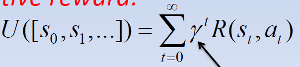
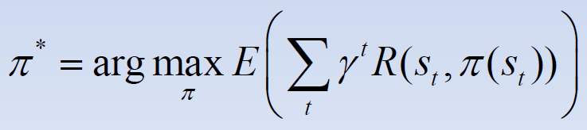
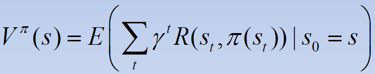
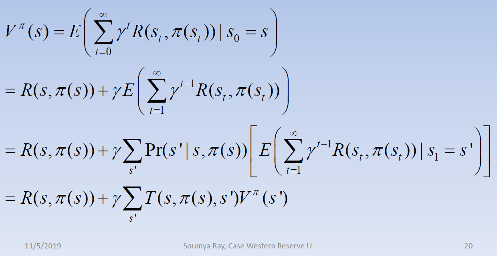

# Lecture #20 (November 05th, 2019) - SDM Under Uncertainty

- we've seen reasoning in uncerain environments
- now we will be selecting actions in a stochastic environments
- to do this, we need a "utility function"

## Utility Function

- capture the *long-term value* of taking an action at some state of the world
- done through rewards aka reinforcement aka evaluative feedback
- the agent then uses this function to maximaze the *expected future reward* (this is the goal)

SDM | Classical Planning
:-- | :-----------------
agent starts w/ no init knowledge of the environment | agent starts w/ detailed structured knowledge
Handles stochastic worlds/actions | deterministic worlds/actions
produces "policy": optimal action f/ each state | produces a "plan" optimal action sequence from init state
propositional only | can be exended to first order worlds/actions
optimize utility | goal-directed

## Issues in SDM

1) Credit Assignment
	- When the agen performs a sequence of actions, the world gives it a reward or penelaty
	- Which action(s) in the sequence were really responsible for the reward/penelaty
1) Exploration vs Exploitation
	- agent does not start w/ knowledge of the world, must explore
	- after it has explored a bit, should it follow its current best policy, or explore to attempt to improve the policy?
	- note that exploration can be dangerous

## SDM Formalization

- a formal model for an SDM is defined via a **Markov Decision Process** (MDP)
- has 6 components
	- a set of states, *S*, representing possible states of the world
	- a set of actions, *A*, representing possible actions of the agent
	- a transition function *T*
	- a reward function *R*
	- init state distrubition, *P0*
	- discount factor, 0 < &gamma; < 1
	
- **Transition Function**:
	- maps a state and action to a probability over the next state
	- <code>T: SxAxS</code>
	- <code>T: SxAxS -> [0,1]</code>
	- <code>T(s,a,s')=Pr(s'|s,a)</code>
		- note the Markov property
	- note: actions in the real world arn't necessarily determinstic
	
- **Reward Function**:
	- maps a state and action to a real number
	- <code>R(s,a)</code>
	- we assume <code>R</code> is a bounded function
	- if there is no feedback from the env when an action is done, will be 0

- Assumptions so far
	- First-Order Markovian dynamics
	- First-Order MArkovian reward process
	- Stationary dynamics and reward
	- Full oservability
	- Static, Single Agent
	
- **Policy**
	- Function that maps states to actions
	- represented by <code>&pi;</code>
	- <code>&pi;(s)</code> is the action the agent will execute @ state x
	- an optimal policy (<code>&pi;*</code>) is a policy that maximizes the expected future reward from any state
		- this is the goal of the agent to learn

- Optimality Criterion

    
	- assume we have an agent following a policy and visits the state sequence of s0, s1, s2, ...
	- We weill measure the utility of the sequence as the "discounted infinite-horizon cumulative reward"
	- with this formula the reward of future states decreases exponentially as the time index increases (because of gamma)

- Discounting
	- two reasons to use:
		1) Behavioral
		1) Mathematical
	- Behavioral: people and animals appear to prefer short term rewards over long term rewards
	- MAthematical: since state sequences can be infinitely long, if we just sum the rewards the sum is not well defined
	
- visit distribution
	- prob dist over states and the subsequent state

- value of a policy
	- expected utility from the policy
	- optimal policy maximizes the expected utility
	
	
- value function
	- defined on a per-state basis
	

- rewriting the value function
	