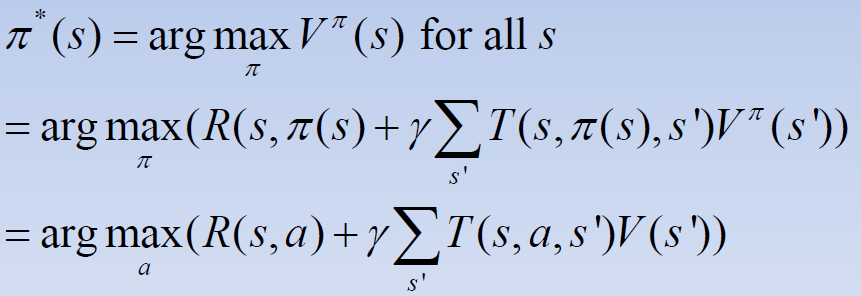
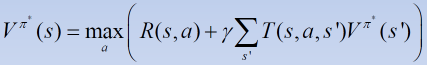
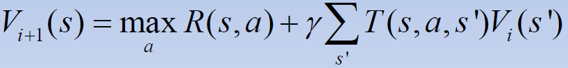
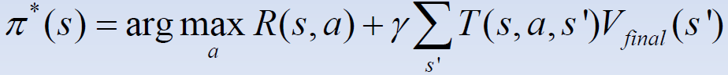
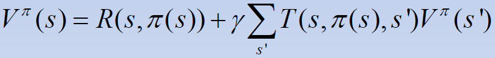
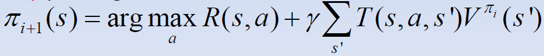

# Lecture #21 (November 07th, 2019) - SDM Under Uncertainty Continued

- consequences
	- every policy &pi; has a (unique) value function V&pi; satisfying the bellman equation
	- the optimal policy pi* also has a value function, V&pi;*
	- remember &pi;* maximizes the expected utility
	
- finding the optimal policy
	- is the policy w/ the largest value function
	
	
- bellman optimality criterion
	- the value of &pi;* can be shown to satisy:
	
	- necessary and sufficient (used to find the optimal policy (garenteed optimal)

- finding the optimal policy
	- can use the bellman optimality criterion
	- if we can find a value that satisfies, can solve the whole thing

## value iteration

- start w/ arbitrary value function V0
	- @ each iteration i, do
	
	- untill <code>abs(Vi+1(s)-Vi(s))</code> is zero
	- Then
	
	- WILL BE ON THE TEST
- convergence of value iteration
	- it can be showen that @ each itaration, the error of the current value function decreases by a factor of (at least) &gamma;
	- for a small discound factor, convergence will occur in less iterations that with a larger discount factor
- example:

# policy iteration

- sequantially update policy rather than value function
- algo:
	1) start w/ init policy
	1) loop untill policy convergence
		1) calculate the value of this policy
			
		1) calculate the new policy using
			
- currently unknown which is bettwe (value or policy iteration)

- we have now solved the credit assignment problem, but not the exploration/exploitation radeoff...